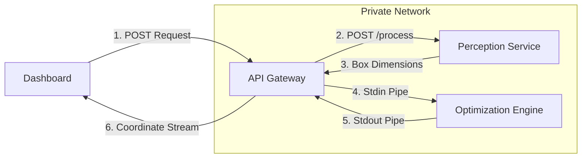

# Seiton

> Autonomous 3D cargo packing optimizer with real-time digital twin visualization.

---

## The Problem

Inefficient container utilization and highly manual cargo placement planning cost the logistics industry billions of dollars annually in wasted fuel, under-utilized space, and shipping delays. The current process relies heavily on human guesswork and slow manual calculations. Furthermore, warehouse operations lack real-time visual feedback to guide loadmasters, leading to placement errors, slow packing throughput, and cargo damage.

---

## The Solution (Features)

Seiton delivers a fully autonomous solution that optimizes the end-to-end container packaging workflow without any human intervention. It marries computer vision with a high-performance C++ heuristic optimization engine to make optimal packing decisions instantly.

* **Autonomous 3D Space Optimization**: Calculates optimal, coordinate-based placements for heterogeneous cargo boxes inside a container, maximizing volume utilization.
* **Computer Vision Cargo Ingestion**: Extracts physical dimensions (length and width) from raw 2D top-down images of cargo staging areas using OpenCV.
* **Interactive 3D Digital Twin**: Animates the sequence of packing steps in a WebGL-powered environment, showing box orientations, structural stress indicators, and placement order.
* **Incremental Live Perception**: An animated overhead crane equipped with a downward-facing perception camera module visually conveys the real-time scanning process. It "captures" the physical dimensions of a newly detected object on the fly, routing it through the C++ engine to calculate its mathematically perfect resting place atop an already partially-filled container.
* **Low-Latency Architecture**: Runs a compiled C++17 optimization binary directly from a Go microservice API via high-speed subprocess pipes, delivering calculations in milliseconds.

---

## Technical Architecture

Seiton uses a multi-tier decoupled microservice architecture to partition CPU-heavy optimization, vision processing, and user interactions:



1. **Dashboard**: React client uploads a staging area photo (Incremental Mode) or box parameters (Bulk Mode) to the API Gateway.
2. **API Gateway**: Receives the request, manages the workflow by calling the Perception Service, and feeds the resulting box coordinates into the Optimization Engine.
3. **Perception Service**: OpenCV analyzes the cargo photo, detects contours, calibrates pixels to metric centimeters using a reference marker, and outputs bounding-box coordinates back to the gateway.
4. **Optimization Engine**: The API Gateway pipes container boundaries and box metrics to a local compiled C++ executable executing the **3D Extreme Point Gravity Drop** algorithm.
5. **Digital Twin**: The calculated execution matrix (containing 3D target coordinates, rotations, and sequence order) is returned to the dashboard where GSAP and React Three Fiber render the 3D packing layout.

---

## Tech Stack

* **Frontend**: React, Vite, Threejs, GSAP
* **API Gateway**: Go
* **Optimization Engine**: C++
* **Perception Pipeline**: Python, FastAPI, OpenCV

---

## Getting Started (Local Installation)

### Prerequisites
* Go 1.23+
* Python 3.14+
* CMake 3.14+ & C++17 Compiler (g++ or clang)
* Node.js 18+ & npm

### 1. Compile the C++ Optimization Engine
```bash
cd optimization
mkdir -p build && cd build
cmake -DCMAKE_BUILD_TYPE=Release ..
cmake --build .
```
Verify that the `optimization_engine` binary exists in the `build/` directory.

### 2. Set Up the Python Perception Service
```bash
cd perception
python -m venv venv
source venv/bin/activate  # On Windows: venv\Scripts\activate
pip install -r requirements.txt
python app.py
```
The service will start locally on `http://localhost:6000`.

### 3. Run the Go API Gateway
Ensure the C++ binary is compiled first.
```bash
cd api-gateway
go run cmd/main.go
```
The API Gateway will start on `http://localhost:8081`.

### 4. Run the React Dashboard
```bash
cd dashboard
npm install
npm run dev
```
Open `http://localhost:5173` in your browser.

---

## Usage

1. **Select Packing Mode**: Click on either **Bulk Mode** (generates and packs a predefined number of random boxes simultaneously to simulate maximum container density) or **Incremental Mode** (uses computer vision to extract items from a camera feed and pack them sequentially onto a baseline of pre-filled boxes).
2. **Input Parameters**: Define the metric dimensions ($L \times W \times H$ in cm) of your target container.
3. **Process**: In Incremental Mode, upload an image of your boxes. In Bulk Mode, set the quantity to generate.
4. **View digital twin**: Click **Generate**. Interact with the 3D canvas (rotate, pan, zoom) to watch the box placement animation step-by-step. In Incremental Mode, you can manually scrub the timeline slider to control the robotic crane as its perception camera scans the object before dropping it perfectly into its calculated target coordinate. Toggle between **Assembly View** and **Stress View** to analyze cargo loading integrity.

---

## Roadmap

* [ ] **Multi-Container Batching**: Algorithmic splitting of cargo across multiple containers when dimensions exceed a single vessel's capacity.
* [ ] **Weight-Distribution Safety Constraints**: Adjust EP placement selections to place heavier items lower and prevent container balance/tipping issues.
* [ ] **Mobile AR Interface**: Enable warehouse operators to view placement guides projected directly onto the physical container using WebXR.
* [ ] **Active Robot Arm API**: Expose standard industrial arm kinematics (ROS2) to allow automated sorting robots to execute the packing plan.

---

## Contributors

* **Divyansh Yadav** 
* **Atharva Ajmera** 
* **Harshal Joshi** 

